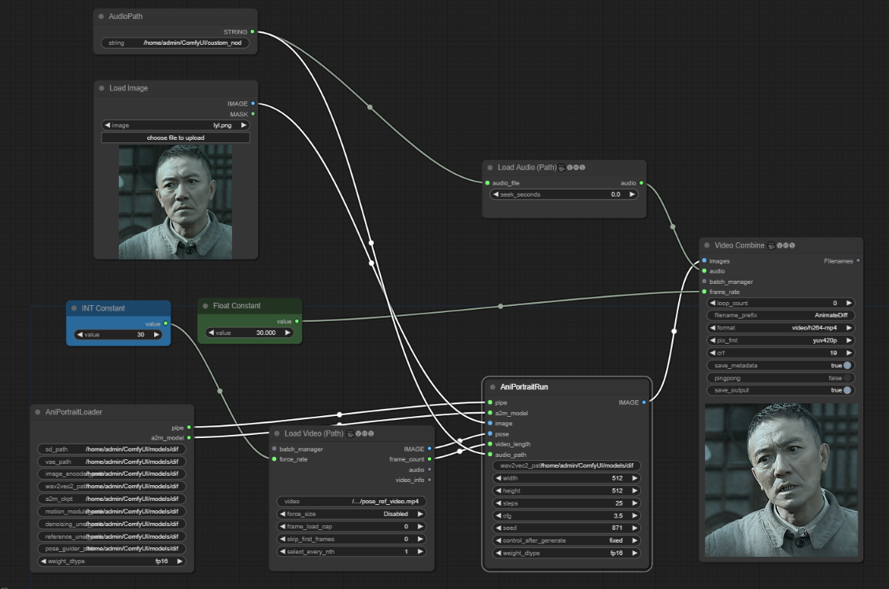

# ComfyUI-AniPortrait

1. base workflow



https://github.com/chaojie/ComfyUI-AniPortrait/blob/main/wf.json

## Installation

### Build environment

We recommend a python version >=3.10 and cuda version =11.7. Then build environment as follows:

```shell
pip install -r requirements.txt
```

### Download weights


1. Download our trained [weights](https://huggingface.co/ZJYang/AniPortrait/tree/main), which include five parts: `denoising_unet.pth`, `reference_unet.pth`, `pose_guider.pth`, `motion_module.pth` and `audio2mesh.pt`.

2. Download pretrained weight of based models and other components: 
    - [StableDiffusion V1.5](https://huggingface.co/runwayml/stable-diffusion-v1-5)
    - [sd-vae-ft-mse](https://huggingface.co/stabilityai/sd-vae-ft-mse)
    - [image_encoder](https://huggingface.co/lambdalabs/sd-image-variations-diffusers/tree/main/image_encoder)
    - [wav2vec2-base-960h](https://huggingface.co/facebook/wav2vec2-base-960h)

3. Enter the appropriate path in the node

## [AniPortrait](https://github.com/Zejun-Yang/AniPortrait)

